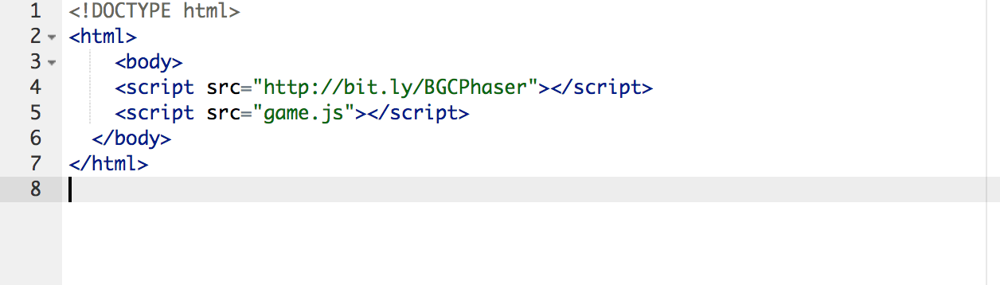

# Game Jam Phaser

## Overview 

You will build a game where the goal is to collect the pigcats. The pigcats will switch between dangerous and safe. If you collect all the pigcats, you win. If you're health goes down to zero, you lose. You will also build in start, win, and lose screens. 

## Part I - Setup

Go to plnkr.co and click "Launch Editor"


Edit your `index.html` to look like below



Delete `script.js` and create a new file named `game.js`. Your window should look like this. 


### Create Initial Variables

Variables are useful for storing data that may change during the game (e.g. your player’s hitPoints).

To create a variable, you have to tell JavaScript:

- The name you’re going to refer to it by
- The value (information) that the variable contains

You only have to declare the variable once. Then you can use it wherever you need.

Let's create a few variables. 


Global means the variables can be used anywhere in our `game.js` file.

Copy and paste the below variables below your intial ones. 

```js
// Links to images
var skyImage = 'https://i.imgur.com/ZCWqpAc.png';
var playerSprites = 'http://i.imgur.com/ODpjVpQ.png';
var pigcatSprites = 'https://i.imgur.com/ut53em3.png';
```

Your `game.js` file should look like this: 


### Preload Function

So in code, we have things called functions. Functions allow us to group our code together and makes our code manageable. Phaser has special functions that it looks for in creating our game. One of them is `preload`, which it uses to set up our game. Create preload function like the one below in your `game.js` below your global variables.


### Create functions

Phaser uses the `create()` function to create all the objects in our game.
Add this function below the `preload()` function.


Everytime we want to add an object to the game, we’ll add a new line  to this function.

Your `game.js` file should look like this now:


### Set up game object

We need to do one final step to finish loading the game. We need to set up a game object to tell Phaser how to load our game. Add this to the top of your code under `// GLOBAL VARIABLES`:


### Initial Sky Image

Go ahead and click the `Run` button. You should get something like this:


## Part II - Game Start

Let's add a `startGame` function below the create function


Now let's update our `create` function to call our `startGame` function


We'll utilize this functionality to start our game when we click the screen.

## Part III - Animations and Sprites

Let's add our player to the game. Update your `preload` and `create` functions like so: 


When you run your code, you should get something like this:


Great job! Now let's animate our player. 

Update your create function to add images from our spritesheet to make it appear our player is walking.


### Player Movement

We want our player to move when we press the arrow keys. In our `create` function we need to set up our game to listen for keyboard presses.


Phaser has another special function called `update`. It calls `update` once every millisecond. We can utilize this function to have our player respond to key presses. Create an `update` function at the bottom of your `game.js` file. 


It's ok if the left and right in your `keyboard.left` and `keyboard.right` doesn't turn green.

Now we need to update our game object to utilize our update object.


Run your code and you should be able to turn your character left and right 


### Challenge 

Can you update the code to add keypresses for up and down? 

Afterwards, you should be able to turn your player in all 4 directions.

### Moving your Player

Now let's make the player actually move across the screen when we press the arrow keys. Update your `update` function to:


You should now be able to move left and right. Update your code so that you can move up and down (Remember that moving up and down means changing the y position of your player instead of the x).

## Adding Enemies

Let's add enemies to our game. 

First, we need to update our `preload()` function 


Then we'll update our create function so that we set up our enemies in the game. 


Then we'll create a function that lets us create enemies randomly. You can copy and paste the below code at the bottom of your `game.js` file.

```js
function createEnemies() {
	var enemy = enemies.create(
(Math.random() * game.world.width), ((Math.random() * game.world.height) - 32), 'baddie');
}
```

You should be able to Run your game and when you click on the screen, you should see a pigcat pop up. 


